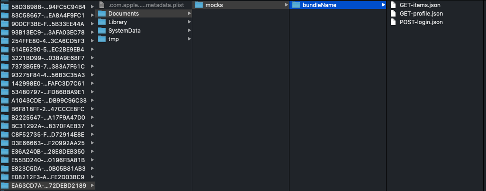
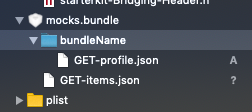

# ddf-mockablelib-ios

## add mockablelib to your app

in your Podfile add
```
pod 'MockableLib', :path => 'absolute/or/relative/path/to/mockablelib'
```

then 
```
pod install
```

## How to Use ?

Config the lib
==============
In your MoyaProvider add the plugin :
```
MoyaMockableConfig(
       bundle: "bundleName", 
       recordEnable: false, 
       useMockEnable: true).setup()
```

sample : 
```
internal let provider = MoyaProvider<Api>(plugins: [NetworkLoggerPlugin(verbose: true), MoyaMockableConfig(bundle: "bundleName", recordEnable: false, useMockEnable: true).setup()])
```

- param1 : (default = "") the bundle name => record/read in separate mock folder (for example record json files for user1 in separate bundle named user1 and then user2 in bundle user2, or each Moya client can have it's separate bundle)
- param2 : (default = false) recordEnable => when you want to save json files
- param3 : (default = false) useMockEnable => when you want to use json files

<span style="color:red">**you can't record and use mock at same times !!!**</span>


Mocks files nomenclature
========================

Example :

network call GET https://mydomain.com/_ah/api/user/v1.0/getUser
 
will create file named :

GET-_ah-api-user-v1.0-getUser.json

Record Json file
==================

When setup mock lib with parameter recordEnable to **true** then every network calls in Json file to your internal app files folder : 




Mock WS with json files
=======================

When setup mock lib with parameter useMockEnable to **true** then every network calls try to find the associated file (related by name) in the mocks.bundle (and subfolder if setup, use as bundle in the library)

create folder called **mocks.bundle** and then add your json file inside like this : 



If not found it try to find the file in Internal app files folder

If not found, it execute the orginal network call.